# mtSmartBuild: High-Level Architecture Diagram

## System Architecture Overview

```mermaid
graph TB
    subgraph "Client Layer"
        U[("👤 End Users<br/>Business Users / Citizen Developers")]
        B["Blazor Server UI<br/>(Interactive Web Application)"]
        SL["SignalR<br/>(Real-time Communication)"]
    end

    subgraph "Application Layer - mtSmartBuild Framework"
        direction TB
        subgraph "Presentation Tier"
            RC["Razor Components"]
            CP["Configuration Pages"]
            AP["Analysis Pages"]
            RP["Reporting Pages"]
        end

        subgraph "Service Tier"
            direction LR
            ORC["Agent Orchestration<br/>Service"]
            CAS["Code Analysis<br/>Service"]
            MFA["Multi-File Analysis<br/>Service"]
            BAS["Batch Analysis<br/>Orchestrator"]
        end

        subgraph "AI Engine"
            direction LR
            AIS["AI Analysis Service<br/>(Semantic Kernel)"]
            PB["Prompt Builder"]
            TE["Token Estimation"]
            RT["Result Transformer"]
        end

        subgraph "Specialist Agents"
            direction LR
            AA["Architectural<br/>Analyst Agent"]
            PA["Performance<br/>Analyst Agent"]
            SA["Security<br/>Analyst Agent"]
        end

        subgraph "Analysis Engine"
            direction LR
            AR["Analyzer Router"]
            LD["Language Detector"]
            RA["Roslyn Analyzer<br/>(C#)"]
            TS["Tree-Sitter Analyzers<br/>(Python, JS, TS, Java, Go)"]
        end

        subgraph "Business Logic"
            direction LR
            BIC["Business Impact<br/>Calculator"]
            BMC["Business Metrics<br/>Calculator"]
            RAS["Risk Assessment"]
            RGS["Recommendation<br/>Generator"]
            CT["Cost Tracking"]
        end

        subgraph "Infrastructure Services"
            direction LR
            FP["File Pre-Processing"]
            FC["File Cache Manager"]
            RL["Rate Limiting"]
            RD["Request Deduplication"]
            IV["Input Validation"]
            EH["Error Handling"]
            LS["Log Sanitization"]
        end
    end

    subgraph "External Services"
        direction LR
        AOAI["Azure OpenAI Service<br/>(GPT Models)"]
        AKV["Azure Key Vault<br/>(Secrets Management)"]
        AAI["Application Insights<br/>(Telemetry & Monitoring)"]
    end

    subgraph "Client-Side Storage"
        direction LR
        BST["Browser Storage<br/>(Encrypted SQLite)"]
        ENC["Per-Browser<br/>Encryption Keys"]
    end

    U --> B
    B <--> SL
    SL --> RC
    RC --> CP & AP & RP
    CP & AP & RP --> ORC & CAS & MFA
    ORC --> AA & PA & SA
    CAS --> AIS
    MFA --> BAS
    BAS --> CAS
    AA & PA & SA --> AIS
    AIS --> PB & TE & RT
    AIS --> AOAI
    CAS --> AR
    AR --> LD
    AR --> RA & TS
    ORC --> BIC & BMC & RAS & RGS & CT
    CAS --> FP & FC
    ORC --> RL & RD
    B --> BST
    BST --> ENC
    AIS --> AKV
    B --> AAI

    style U fill:#E8F5E9,stroke:#388E3C
    style AOAI fill:#E3F2FD,stroke:#1976D2
    style AKV fill:#FFF3E0,stroke:#F57C00
    style AAI fill:#F3E5F5,stroke:#7B1FA2
    style ORC fill:#FFEBEE,stroke:#D32F2F
    style AIS fill:#E3F2FD,stroke:#1976D2
```

## Architecture Layers Description

| Layer | Components | Responsibility |
|-------|-----------|----------------|
| **Client Layer** | Blazor Server, SignalR | Interactive UI, real-time updates |
| **Presentation Tier** | Razor Components | Configuration, analysis views, reports |
| **Service Tier** | Orchestration, Analysis, Batch Processing | Workflow coordination and analysis management |
| **AI Engine** | Semantic Kernel, Prompt Builder, Token Estimator | AI model integration and prompt management |
| **Specialist Agents** | Architectural, Performance, Security Analysts | Domain-specific AI-powered code analysis |
| **Analysis Engine** | Roslyn, Tree-Sitter, Language Detection | Multi-language static code analysis |
| **Business Logic** | Impact Calculator, Risk Assessment, Recommendations | Business value and cost analysis |
| **Infrastructure** | Caching, Rate Limiting, Validation, Error Handling | Cross-cutting reliability concerns |
| **External Services** | Azure OpenAI, Key Vault, App Insights | Cloud AI, security, and monitoring |
| **Client Storage** | Browser SQLite, Encryption | Secure client-side data persistence |
