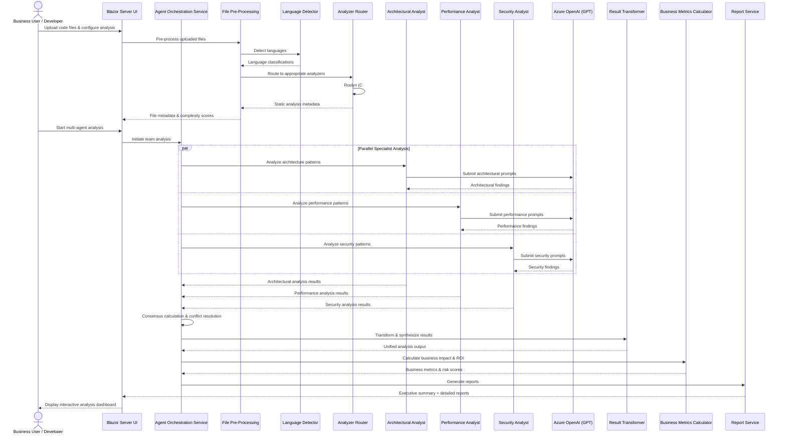
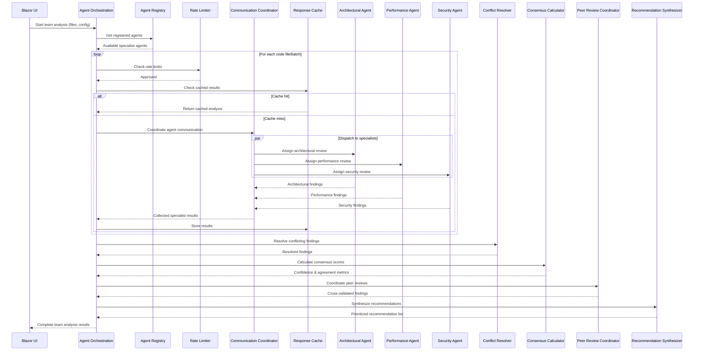
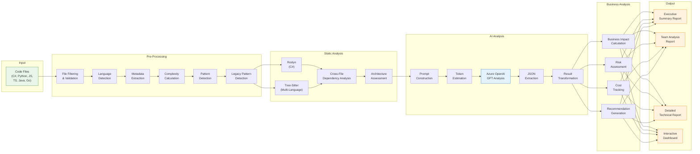
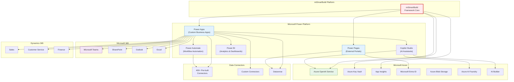

# mtSmartBuild: System Interaction Diagrams

## 1. End-to-End Code Analysis Flow (Sequence Diagram)

## 2. Multi-Agent Orchestration Flow

## 3. Data Flow: File Upload to Report Generation

## 4. Microsoft Ecosystem Integration Map

