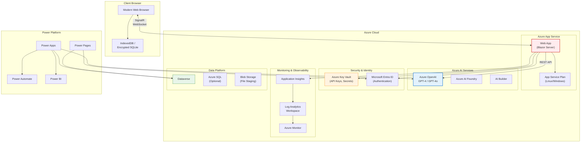
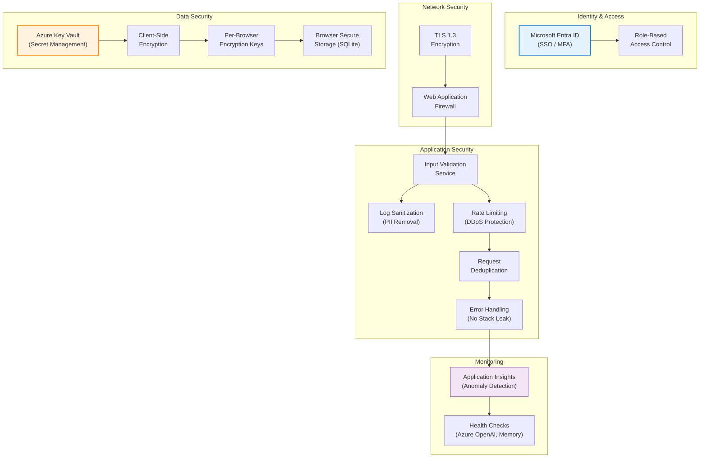
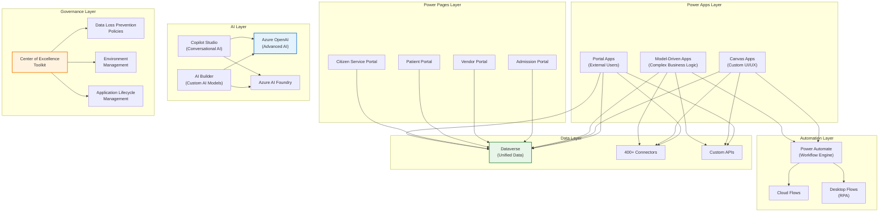

# mtSmartBuild: Component Architecture Diagrams

## 1. Service Layer Component Diagram

```mermaid
graph TB
    subgraph "Presentation Layer"
        direction LR
        CFG["Configuration<br/>Components"]
        ANA["Analysis<br/>Components"]
        MFA["Multi-File Analysis<br/>Components"]
        GT["Ground Truth<br/>Components"]
        DET["Determinism<br/>Components"]
        SHR["Shared UI<br/>Components"]
    end

    subgraph "Orchestration Layer"
        direction LR
        AOS["Agent Orchestration<br/>Service"]
        ACC["Agent Communication<br/>Coordinator"]
        BAO["Batch Analysis<br/>Orchestrator"]
        PRC["Peer Review<br/>Coordinator"]
        CRS["Conflict Resolver"]
        CON["Consensus Calculator"]
        RCS["Recommendation<br/>Synthesizer"]
    end

    subgraph "AI Services Layer"
        direction LR
        AIA["AI Analysis Service"]
        PBD["Prompt Builder"]
        RJE["Robust JSON<br/>Extractor"]
        RST["Result Transformer"]
        TKE["Token Estimation"]
        RCC["Resilient Chat<br/>Completion"]
        LCF["Legacy Context<br/>Formatter"]
        ESG["Executive Summary<br/>Generator"]
    end

    subgraph "Analysis Layer"
        direction LR
        ANR["Analyzer Router"]
        LNG["Language<br/>Detector"]
        ROS["Roslyn C#<br/>Analyzer"]
        TSR["Tree-Sitter<br/>Language Registry"]
        TSP["Tree-Sitter<br/>Python Analyzer"]
        TSJ["Tree-Sitter<br/>JavaScript Analyzer"]
        TST["Tree-Sitter<br/>TypeScript Analyzer"]
        TSJA["Tree-Sitter<br/>Java Analyzer"]
        TSG["Tree-Sitter<br/>Go Analyzer"]
        HML["Hybrid Multi-Language<br/>Analyzer"]
    end

    subgraph "Specialist Agent Layer"
        direction LR
        AAA["Architectural<br/>Analyst Agent"]
        PAA["Performance<br/>Analyst Agent"]
        SAA["Security<br/>Analyst Agent"]
        ARS["Agent Registry<br/>Service"]
        ARL["Agent Rate<br/>Limiter"]
    end

    subgraph "Business Services Layer"
        direction LR
        BIC["Business Impact<br/>Calculator"]
        BMC["Business Metrics<br/>Calculator"]
        RAS["Risk Assessment<br/>Service"]
        RGS["Recommendation<br/>Generator"]
        CTS["Cost Tracking<br/>Service"]
    end

    subgraph "Infrastructure Layer"
        direction LR
        FPS["File Pre-Processing"]
        FCM["File Cache<br/>Manager"]
        FFS["File Filtering"]
        FDS["File Download"]
        RLS["Rate Limit<br/>Service"]
        RDS["Request<br/>Deduplication"]
        IVS["Input<br/>Validation"]
        EHS["Error<br/>Handling"]
        LSS["Log<br/>Sanitization"]
        TRS["Tracing<br/>Service"]
    end

    subgraph "Quality Assurance Layer"
        direction LR
        GTV["Ground Truth<br/>Validation"]
        DMS["Determinism<br/>Measurement"]
        CVS["Confidence<br/>Validation"]
        FVS["Finding<br/>Validation"]
    end

    subgraph "Persistence Layer"
        direction LR
        BSS["Browser Storage<br/>Service"]
        BAR["Browser Analysis<br/>Repository"]
        BPR["Browser Preferences<br/>Repository"]
        SCI["Secure Client<br/>Interop"]
        EKS["Encryption Key<br/>Strategy"]
        ARC["Agent Response<br/>Cache"]
    end

    CFG & ANA & MFA --> AOS
    AOS --> ACC & BAO & PRC
    AOS --> AAA & PAA & SAA
    AOS --> ARS & ARL
    AAA & PAA & SAA --> AIA
    AIA --> PBD & RJE & RST & TKE & RCC
    AIA --> LCF & ESG
    AOS --> ANR
    ANR --> LNG & ROS & TSR
    TSR --> TSP & TSJ & TST & TSJA & TSG
    ANR --> HML
    AOS --> BIC & BMC & RAS & RGS & CTS
    PRC --> CRS & CON & RCS
    AOS --> FPS & FCM & RLS & RDS
    ANA --> GTV & DMS
    GTV --> CVS & FVS
    BSS --> BAR & BPR & SCI & EKS
    AIA --> ARC

    style AOS fill:#FFEBEE,stroke:#D32F2F,stroke-width:2px
    style AIA fill:#E3F2FD,stroke:#1976D2,stroke-width:2px
    style ANR fill:#E8F5E9,stroke:#388E3C,stroke-width:2px
```

## 2. Deployment Architecture

## 3. Security Architecture

## 4. Power Apps & Power Pages Integration Architecture

