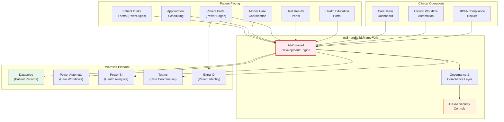
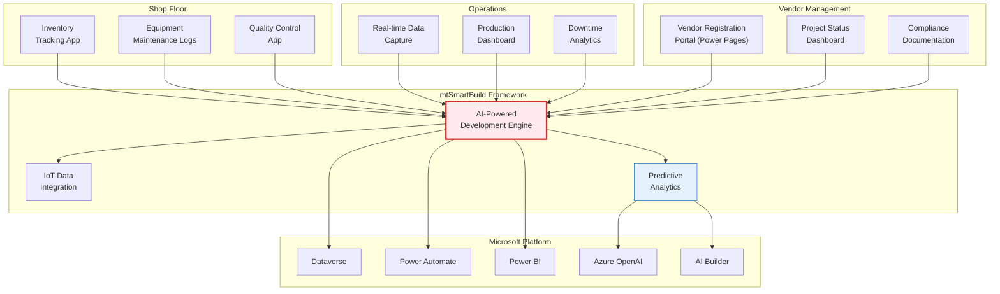
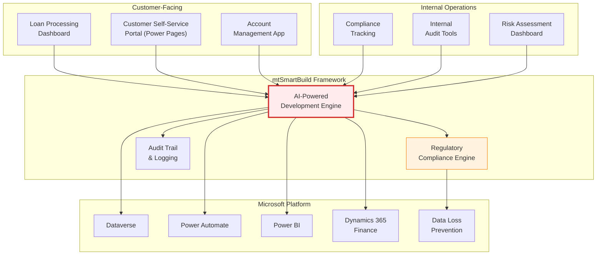
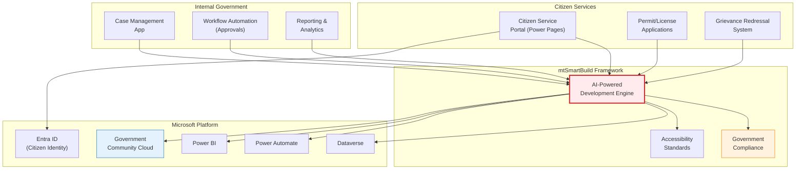
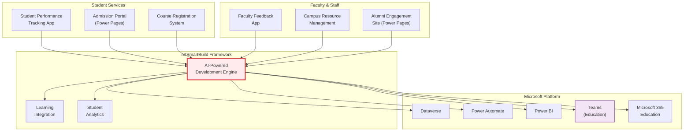

# mtSmartBuild: Industry Solution Architecture Diagrams

## 1. Healthcare Solution Architecture

## 2. Manufacturing Solution Architecture

## 3. Financial Services Solution Architecture

## 4. Government & Public Sector Solution Architecture

## 5. Education Solution Architecture

