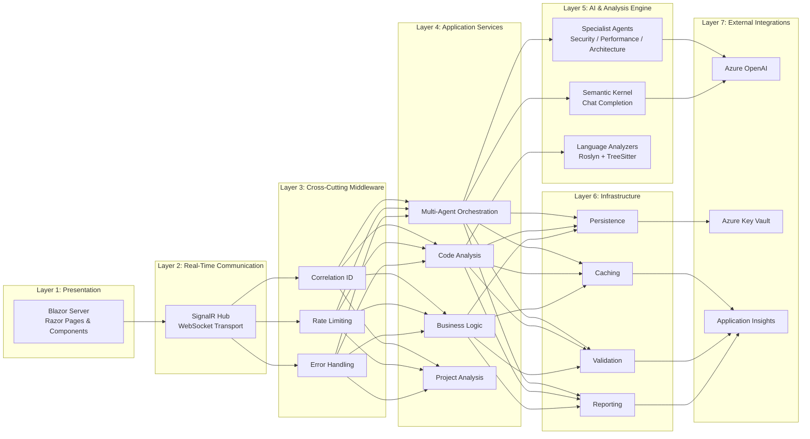

# Architecture Overview - Legacy Code Analyzer

## High-Level System Architecture

```mermaid
graph TB
    subgraph "Presentation Layer"
        UI[Blazor Server UI]
        Pages[Razor Pages<br/>Index / MultiFile / AgentAnalysis<br/>MultiAgentOrchestration<br/>DeterminismMeasurement<br/>GroundTruthValidation]
        SharedComp[Shared Components<br/>BadgeWithIcon / CardHeader<br/>CollapsibleSection / ErrorAlert<br/>MetricBox / MetricCard<br/>ProgressPhaseIndicator / SkeletonCard]
    end

    subgraph "SignalR / Real-Time"
        Hub[Blazor Hub<br/>SignalR WebSocket]
    end

    subgraph "Middleware Pipeline"
        CorrMW[Correlation ID Middleware]
        RateMW[Rate Limit Middleware]
    end

    subgraph "Service Layer"
        subgraph "AI Services"
            AIAnalysis[AI Analysis Service]
            PromptBuilder[Prompt Builder Service]
            TokenEst[Token Estimation Service]
            ResilientChat[Resilient Chat Completion<br/>Retry + Circuit Breaker]
            ExecSummary[Executive Summary Generator]
            JsonExtract[Robust JSON Extractor]
            ResultTransform[Result Transformer Service]
            LegacyCtx[Legacy Context Formatter]
        end

        subgraph "Multi-Agent Orchestration"
            AgentOrch[Agent Orchestration Service]
            AgentReg[Agent Registry]
            AgentComm[Agent Communication Coordinator]
            Consensus[Consensus Calculator]
            Conflict[Conflict Resolver]
            PeerReview[Peer Review Coordinator]
            RecommSynth[Recommendation Synthesizer]
        end

        subgraph "Specialist Agents"
            SecAgent[Security Analyst Agent]
            PerfAgent[Performance Analyst Agent]
            ArchAgent[Architectural Analyst Agent]
        end

        subgraph "Code Analysis"
            CodeAnalysis[Code Analysis Service]
            FilePreProc[File Pre-Processing Service<br/>Facade]
            ComplexCalc[Complexity Calculation Service]
            PatternDet[Pattern Detection Service]
            LegacyDet[Legacy Pattern Detection]
            MetadataExt[Metadata Extraction Service]
            CrossFile[Cross-File Analyzer]
            DepGraph[Dependency Graph Service]
            HybridAnalyzer[Hybrid Multi-Language Analyzer]
        end

        subgraph "Language Analyzers"
            AnalyzerRouter[Analyzer Router]
            LangDetect[Language Detector]
            RoslynCS[Roslyn C# Analyzer]
            TSPython[TreeSitter Python Analyzer]
            TSJS[TreeSitter JavaScript Analyzer]
            TSTS[TreeSitter TypeScript Analyzer]
            TSJava[TreeSitter Java Analyzer]
            TSGo[TreeSitter Go Analyzer]
        end

        subgraph "Business Services"
            BizMetrics[Business Metrics Calculator]
            RiskAssess[Risk Assessment Service]
            RecommGen[Recommendation Generator]
            CostTrack[Cost Tracking Service]
            BizImpact[Business Impact Calculator]
        end

        subgraph "Reporting"
            ReportSvc[Report Service]
            TeamReport[Team Report Service]
            ExecReport[Executive Report Service]
        end

        subgraph "Project Analysis"
            ProjMeta[Project Metadata Service]
            FolderAnalysis[Folder Analysis Service]
            ArchAssess[Architecture Assessment Service]
            ProjInsights[Project Insights Generator]
            EnhProjAnalysis[Enhanced Project Analysis Service]
        end

        subgraph "Infrastructure Services"
            RateLimit[Rate Limit Service]
            InputValid[Input Validation Service]
            ErrorHandle[Error Handling Service]
            ReqDedup[Request Deduplication]
            Tracing[Tracing Service]
            LogSanit[Log Sanitization Service]
            FileDownload[File Download Service]
            FileCache[File Cache Manager]
            FileFilter[File Filtering Service]
        end

        subgraph "Persistence Layer"
            BrowserStorage[Browser Storage Service]
            SecureInterop[Secure Client Interop]
            EncryptKey[Encryption Key Strategy<br/>AES-GCM]
            AnalysisRepo[Browser Analysis Repository]
            AgentSessionRepo[Browser Agent Session Repository]
            PrefsRepo[Browser Preferences Repository]
        end

        subgraph "Validation & Quality"
            FindingValid[Finding Validation Service]
            ConfValid[Confidence Validation Service]
            GroundTruth[Ground Truth Validation Service]
            Determinism[Determinism Measurement Service]
        end

        subgraph "Caching"
            AgentCache[Agent Response Cache Service]
            MemCache[Memory Cache]
        end
    end

    subgraph "External Services"
        AzureOAI[Azure OpenAI<br/>GPT Models]
        AzureKV[Azure Key Vault<br/>Secrets Management]
        AppInsights[Azure Application Insights<br/>Monitoring & Telemetry]
    end

    subgraph "Client Browser"
        SQLite[Browser SQLite<br/>Encrypted Storage]
        IndexedDB[IndexedDB<br/>Encrypted Sessions]
    end

    %% Connections
    UI --> Hub
    Hub --> Pages
    Pages --> SharedComp
    Hub --> CorrMW --> RateMW

    RateMW --> AgentOrch
    RateMW --> CodeAnalysis
    RateMW --> EnhProjAnalysis

    AgentOrch --> AgentReg
    AgentOrch --> AgentComm
    AgentOrch --> Consensus
    AgentOrch --> RecommSynth
    AgentOrch --> ExecSummary
    AgentOrch --> FilePreProc
    AgentComm --> SecAgent & PerfAgent & ArchAgent

    SecAgent & PerfAgent & ArchAgent --> ResilientChat
    AIAnalysis --> ResilientChat
    ResilientChat --> AzureOAI

    CodeAnalysis --> FilePreProc
    FilePreProc --> MetadataExt
    FilePreProc --> ComplexCalc
    FilePreProc --> PatternDet
    MetadataExt --> AnalyzerRouter
    AnalyzerRouter --> LangDetect
    AnalyzerRouter --> RoslynCS & TSPython & TSJS & TSTS & TSJava & TSGo

    AgentOrch --> BizMetrics
    BizMetrics --> RiskAssess
    BizMetrics --> CostTrack

    AgentOrch --> ReportSvc
    ReportSvc --> TeamReport
    ReportSvc --> ExecReport

    BrowserStorage --> SecureInterop
    SecureInterop --> EncryptKey
    BrowserStorage --> AnalysisRepo & AgentSessionRepo & PrefsRepo
    AnalysisRepo & AgentSessionRepo --> SQLite
    PrefsRepo --> IndexedDB

    ResilientChat -.-> AppInsights
    Tracing -.-> AppInsights
    ErrorHandle -.-> AppInsights

    AzureKV -.-> ResilientChat
```

## Layered Architecture View

```mermaid
graph LR
    subgraph "Layer 1: Presentation"
        A1[Blazor Server<br/>Razor Pages & Components]
    end

    subgraph "Layer 2: Real-Time Communication"
        B1[SignalR Hub<br/>WebSocket Transport]
    end

    subgraph "Layer 3: Cross-Cutting Middleware"
        C1[Correlation ID]
        C2[Rate Limiting]
        C3[Error Handling]
    end

    subgraph "Layer 4: Application Services"
        D1[Multi-Agent Orchestration]
        D2[Code Analysis]
        D3[Business Logic]
        D4[Project Analysis]
    end

    subgraph "Layer 5: AI & Analysis Engine"
        E1[Specialist Agents<br/>Security / Performance / Architecture]
        E2[Semantic Kernel<br/>Chat Completion]
        E3[Language Analyzers<br/>Roslyn + TreeSitter]
    end

    subgraph "Layer 6: Infrastructure"
        F1[Caching]
        F2[Persistence]
        F3[Validation]
        F4[Reporting]
    end

    subgraph "Layer 7: External Integrations"
        G1[Azure OpenAI]
        G2[Azure Key Vault]
        G3[Application Insights]
    end

    A1 --> B1 --> C1 & C2 & C3
    C1 & C2 & C3 --> D1 & D2 & D3 & D4
    D1 --> E1 & E2
    D2 --> E3
    D1 & D2 & D3 --> F1 & F2 & F3 & F4
    E1 & E2 --> G1
    F2 --> G2
    F1 & F3 & F4 --> G3
```
