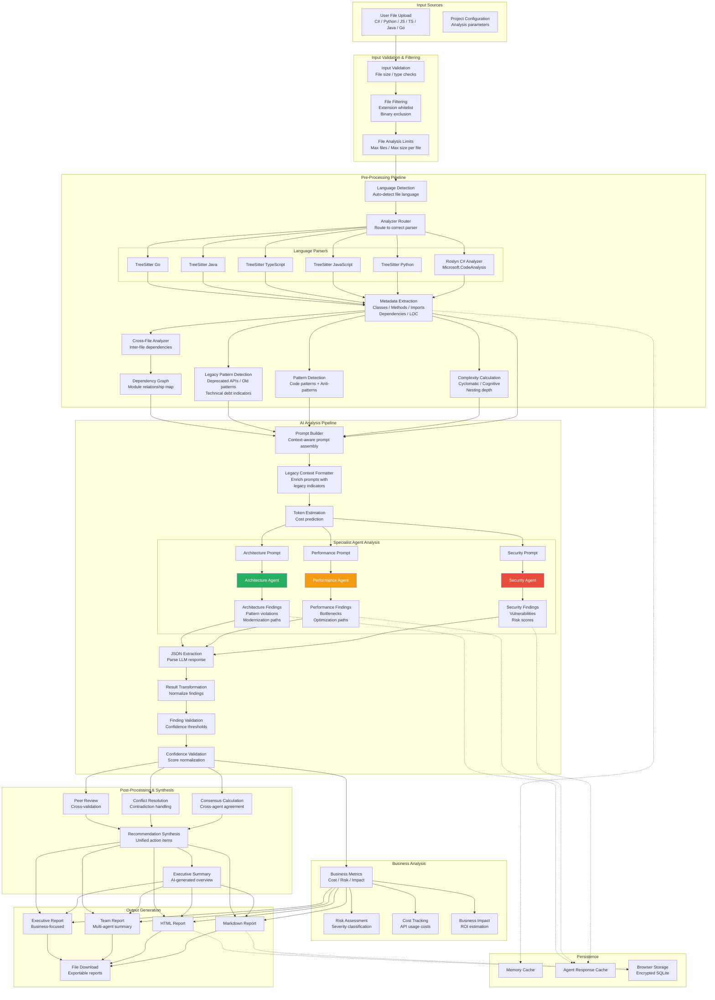
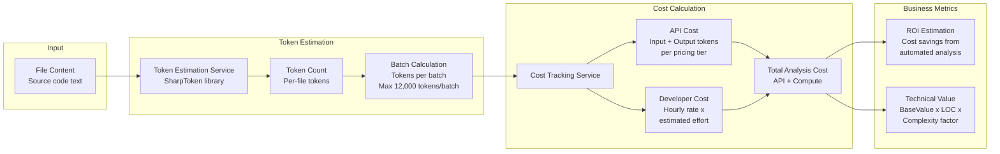
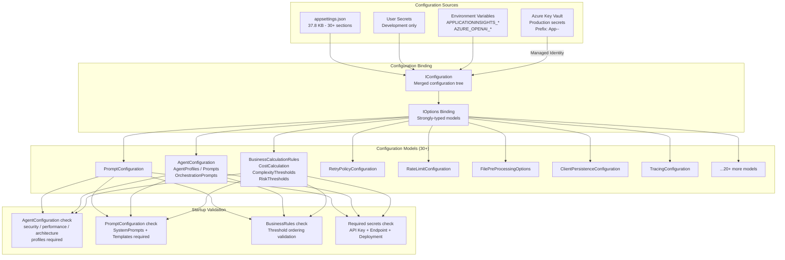
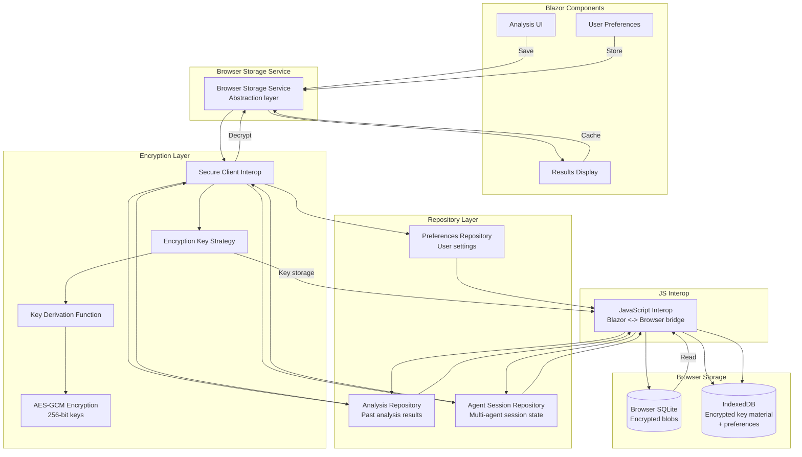

# Data Flow Diagrams - Legacy Code Analyzer

## End-to-End Data Flow

```mermaid
flowchart TB
    subgraph "Input Sources"
        UF[User File Upload<br/>C# / Python / JS / TS / Java / Go]
        PC[Project Configuration<br/>Analysis parameters]
    end

    subgraph "Input Validation & Filtering"
        IV[Input Validation<br/>File size / type checks]
        FF[File Filtering<br/>Extension whitelist<br/>Binary exclusion]
        FL[File Analysis Limits<br/>Max files / Max size per file]
    end

    subgraph "Pre-Processing Pipeline"
        LD[Language Detection<br/>Auto-detect file language]
        AR[Analyzer Router<br/>Route to correct parser]

        subgraph "Language Parsers"
            RC[Roslyn C# Analyzer<br/>Microsoft.CodeAnalysis]
            TP[TreeSitter Python]
            TJS[TreeSitter JavaScript]
            TTS[TreeSitter TypeScript]
            TJ[TreeSitter Java]
            TG[TreeSitter Go]
        end

        ME[Metadata Extraction<br/>Classes / Methods / Imports<br/>Dependencies / LOC]
        CC[Complexity Calculation<br/>Cyclomatic / Cognitive<br/>Nesting depth]
        PD[Pattern Detection<br/>Code patterns + Anti-patterns]
        LPD[Legacy Pattern Detection<br/>Deprecated APIs / Old patterns<br/>Technical debt indicators]
        CFA[Cross-File Analyzer<br/>Inter-file dependencies]
        DG[Dependency Graph<br/>Module relationship map]
    end

    subgraph "AI Analysis Pipeline"
        PB[Prompt Builder<br/>Context-aware prompt assembly]
        LCF[Legacy Context Formatter<br/>Enrich prompts with<br/>legacy indicators]
        TE[Token Estimation<br/>Cost prediction]

        subgraph "Specialist Agent Analysis"
            SA_In[Security Prompt] --> SA[Security Agent] --> SA_Out[Security Findings<br/>Vulnerabilities<br/>Risk scores]
            PA_In[Performance Prompt] --> PA[Performance Agent] --> PA_Out[Performance Findings<br/>Bottlenecks<br/>Optimization paths]
            AA_In[Architecture Prompt] --> AA[Architecture Agent] --> AA_Out[Architecture Findings<br/>Pattern violations<br/>Modernization paths]
        end

        JE[JSON Extraction<br/>Parse LLM response]
        RT[Result Transformation<br/>Normalize findings]
        FV[Finding Validation<br/>Confidence thresholds]
        CV[Confidence Validation<br/>Score normalization]
    end

    subgraph "Post-Processing & Synthesis"
        CON[Consensus Calculation<br/>Cross-agent agreement]
        CR[Conflict Resolution<br/>Contradiction handling]
        PR[Peer Review<br/>Cross-validation]
        RS[Recommendation Synthesis<br/>Unified action items]
        ES[Executive Summary<br/>AI-generated overview]
    end

    subgraph "Business Analysis"
        BM[Business Metrics<br/>Cost / Risk / Impact]
        RA[Risk Assessment<br/>Severity classification]
        CT[Cost Tracking<br/>API usage costs]
        BI[Business Impact<br/>ROI estimation]
    end

    subgraph "Output Generation"
        MR[Markdown Report]
        HR[HTML Report]
        TR[Team Report<br/>Multi-agent summary]
        ER[Executive Report<br/>Business-focused]
        FD[File Download<br/>Exportable reports]
    end

    subgraph "Persistence"
        MC[Memory Cache]
        ARC[Agent Response Cache]
        BS[Browser Storage<br/>Encrypted SQLite]
    end

    %% Input flow
    UF --> IV --> FF --> FL

    %% Pre-processing flow
    FL --> LD --> AR
    AR --> RC & TP & TJS & TTS & TJ & TG
    RC & TP & TJS & TTS & TJ & TG --> ME
    ME --> CC & PD & LPD
    ME --> CFA --> DG

    %% AI analysis flow
    ME & CC & PD & LPD & DG --> PB
    PB --> LCF
    LCF --> TE
    TE --> SA_In & PA_In & AA_In
    SA_Out & PA_Out & AA_Out --> JE --> RT --> FV --> CV

    %% Post-processing flow
    CV --> CON & CR & PR
    CON & CR & PR --> RS --> ES

    %% Business analysis flow
    CV --> BM
    BM --> RA & CT & BI

    %% Output flow
    ES & RS & BM --> MR & HR & TR & ER
    MR & HR & TR & ER --> FD

    %% Caching
    ME -.-> MC
    SA_Out & PA_Out & AA_Out -.-> ARC
    MR & HR -.-> BS

    style SA fill:#e74c3c,color:#fff
    style PA fill:#f39c12,color:#fff
    style AA fill:#27ae60,color:#fff
```

## Token & Cost Tracking Data Flow

```mermaid
flowchart LR
    subgraph "Input"
        FC[File Content<br/>Source code text]
    end

    subgraph "Token Estimation"
        TE[Token Estimation Service<br/>SharpToken library]
        TC[Token Count<br/>Per-file tokens]
        BC[Batch Calculation<br/>Tokens per batch<br/>Max 12,000 tokens/batch]
    end

    subgraph "Cost Calculation"
        CT[Cost Tracking Service]
        APICost[API Cost<br/>Input + Output tokens<br/>per pricing tier]
        DevCost[Developer Cost<br/>Hourly rate x<br/>estimated effort]
        TotalCost[Total Analysis Cost<br/>API + Compute]
    end

    subgraph "Business Metrics"
        ROI[ROI Estimation<br/>Cost savings from<br/>automated analysis]
        TV[Technical Value<br/>BaseValue x LOC x<br/>Complexity factor]
    end

    FC --> TE --> TC --> BC
    BC --> CT
    CT --> APICost & DevCost
    APICost & DevCost --> TotalCost
    TotalCost --> ROI & TV
```

## Configuration Data Flow

```mermaid
flowchart TB
    subgraph "Configuration Sources"
        AS[appsettings.json<br/>37.8 KB - 30+ sections]
        US[User Secrets<br/>Development only]
        EV[Environment Variables<br/>APPLICATIONINSIGHTS_*<br/>AZURE_OPENAI_*]
        KV[Azure Key Vault<br/>Production secrets<br/>Prefix: App--]
    end

    subgraph "Configuration Binding"
        IConfig[IConfiguration<br/>Merged configuration tree]
        Bind[IOptions Binding<br/>Strongly-typed models]
    end

    subgraph "Configuration Models (30+)"
        M1[PromptConfiguration]
        M2[AgentConfiguration<br/>AgentProfiles / Prompts<br/>OrchestrationPrompts]
        M3[BusinessCalculationRules<br/>CostCalculation<br/>ComplexityThresholds<br/>RiskThresholds]
        M4[RetryPolicyConfiguration]
        M5[RateLimitConfiguration]
        M6[FilePreProcessingOptions]
        M7[ClientPersistenceConfiguration]
        M8[TracingConfiguration]
        M9[...20+ more models]
    end

    subgraph "Startup Validation"
        V1[AgentConfiguration check<br/>security / performance / architecture<br/>profiles required]
        V2[PromptConfiguration check<br/>SystemPrompts + Templates required]
        V3[BusinessRules check<br/>Threshold ordering validation]
        V4[Required secrets check<br/>API Key + Endpoint + Deployment]
    end

    AS & US & EV --> IConfig
    KV -->|Managed Identity| IConfig
    IConfig --> Bind
    Bind --> M1 & M2 & M3 & M4 & M5 & M6 & M7 & M8 & M9
    M1 & M2 & M3 --> V1 & V2 & V3 & V4
```

## Client-Side Data Flow

```mermaid
flowchart TB
    subgraph "Blazor Components"
        UI[Analysis UI]
        Results[Results Display]
        Prefs[User Preferences]
    end

    subgraph "Browser Storage Service"
        BSS[Browser Storage Service<br/>Abstraction layer]
    end

    subgraph "Encryption Layer"
        SCI[Secure Client Interop]
        EKS[Encryption Key Strategy]
        KDF[Key Derivation Function]
        AES[AES-GCM Encryption<br/>256-bit keys]
    end

    subgraph "Repository Layer"
        BAR[Analysis Repository<br/>Past analysis results]
        BASR[Agent Session Repository<br/>Multi-agent session state]
        BPR[Preferences Repository<br/>User settings]
    end

    subgraph "JS Interop"
        JSI[JavaScript Interop<br/>Blazor <-> Browser bridge]
    end

    subgraph "Browser Storage"
        SQLite[(Browser SQLite<br/>Encrypted blobs)]
        IDB[(IndexedDB<br/>Encrypted key material<br/>+ preferences)]
    end

    UI -->|Save| BSS
    Results -->|Cache| BSS
    Prefs -->|Store| BSS

    BSS --> SCI
    SCI --> EKS --> KDF --> AES

    SCI --> BAR & BASR & BPR
    BAR & BASR --> JSI --> SQLite
    BPR --> JSI --> IDB
    EKS -->|Key storage| JSI --> IDB

    SQLite -->|Read| JSI --> BAR & BASR --> SCI -->|Decrypt| BSS --> Results
```
