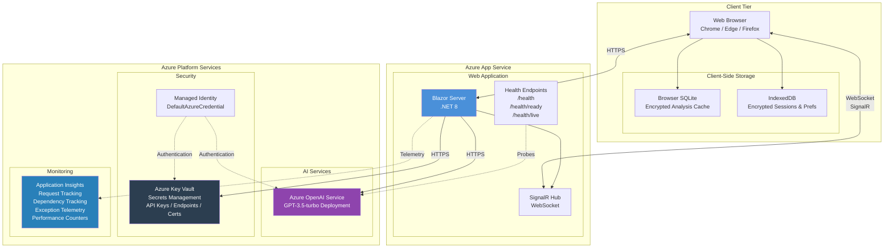
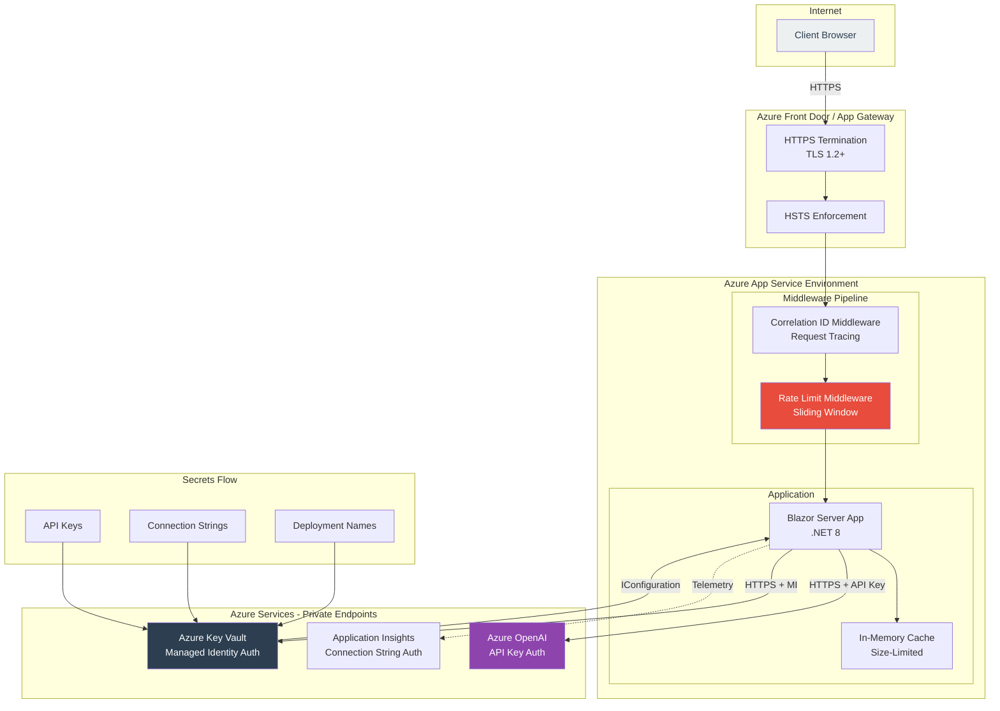
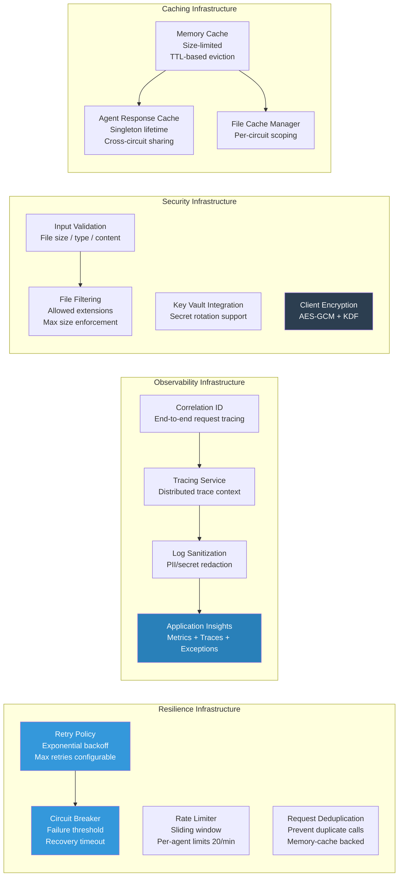
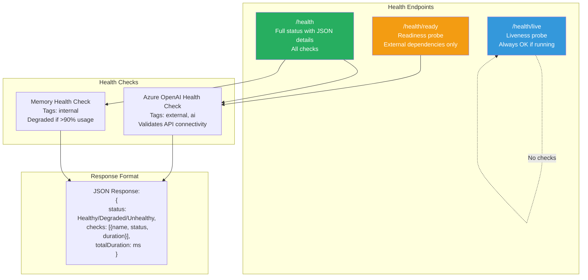

# Deployment Architecture - Legacy Code Analyzer

## Azure Cloud Deployment Topology

## Network & Security Architecture

## Infrastructure Component Responsibilities

## Health Check Architecture

