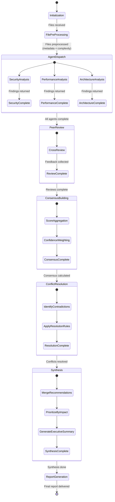
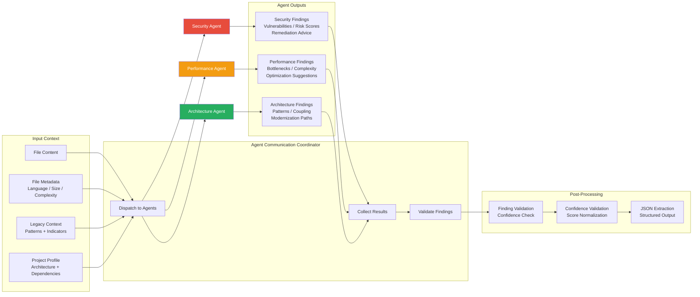
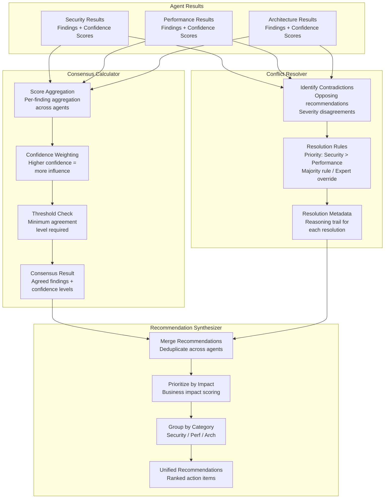

# Multi-Agent Orchestration Architecture

## Agent Ecosystem Overview

```mermaid
graph TB
    subgraph "Orchestration Layer"
        AOS[Agent Orchestration Service]
        ARL[Agent Rate Limiter<br/>20 calls/min per agent]
    end

    subgraph "Coordination Services"
        AR[Agent Registry Service]
        ACC[Agent Communication<br/>Coordinator]
        CC[Consensus Calculator Service]
        CRS[Conflict Resolver Service]
        PRC[Peer Review Coordinator]
        RS[Recommendation Synthesizer]
        ESG[Executive Summary Generator]
    end

    subgraph "Specialist Agent Pool"
        subgraph "Security Analyst Agent"
            SA[Security Agent]
            SA_P[Security Prompt Template]
            SA_LI[Security Legacy Indicators]
            SA_LC[Security Legacy Context Messages]
        end

        subgraph "Performance Analyst Agent"
            PA[Performance Agent]
            PA_P[Performance Prompt Template]
            PA_LI[Performance Legacy Indicators]
            PA_LC[Performance Legacy Context Messages]
        end

        subgraph "Architectural Analyst Agent"
            AA[Architecture Agent]
            AA_P[Architecture Prompt Template]
            AA_LI[Architecture Legacy Indicators]
            AA_LC[Architecture Legacy Context Messages]
        end
    end

    subgraph "AI Infrastructure"
        SK[Semantic Kernel]
        RCS[Resilient Chat Completion<br/>Retry + Circuit Breaker]
        TE[Token Estimation Service]
        RJE[Robust JSON Extractor]
        RT[Result Transformer Service]
    end

    subgraph "Support Services"
        FPP[File Pre-Processing Service]
        IV[Input Validation Service]
        EH[Error Handling Service]
        RD[Request Deduplication]
        CT[Cost Tracking Service]
        TS[Tracing Service]
    end

    subgraph "Azure OpenAI"
        LLM[GPT Model<br/>Chat Completion API]
    end

    AOS --> AR
    AOS --> ACC
    AOS --> CC
    AOS --> CRS
    AOS --> RS
    AOS --> ESG
    AOS --> FPP
    AOS --> IV
    AOS --> EH
    AOS -.-> RD
    AOS -.-> CT
    AOS -.-> TS
    AOS --> ARL

    ACC --> SA & PA & AA

    SA --> SA_P & SA_LI & SA_LC
    PA --> PA_P & PA_LI & PA_LC
    AA --> AA_P & AA_LI & AA_LC

    SA & PA & AA --> SK
    SK --> RCS
    RCS --> LLM

    SA & PA & AA --> RJE
    SA & PA & AA --> RT
    SA & PA & AA --> TE

    PRC --> SA & PA & AA

    style AOS fill:#4a90d9,color:#fff
    style SA fill:#e74c3c,color:#fff
    style PA fill:#f39c12,color:#fff
    style AA fill:#27ae60,color:#fff
    style LLM fill:#8e44ad,color:#fff
```

## Agent Analysis Workflow - State Machine

```mermaid
stateDiagram-v2
    [*] --> Initialization

    Initialization --> FilePreProcessing: Files received
    FilePreProcessing --> AgentDispatch: Files preprocessed<br/>(metadata + complexity)

    state AgentDispatch {
        [*] --> SecurityAnalysis
        [*] --> PerformanceAnalysis
        [*] --> ArchitectureAnalysis

        SecurityAnalysis --> SecurityComplete: Findings returned
        PerformanceAnalysis --> PerformanceComplete: Findings returned
        ArchitectureAnalysis --> ArchitectureComplete: Findings returned
    }

    AgentDispatch --> PeerReview: All agents complete

    state PeerReview {
        [*] --> CrossReview
        CrossReview --> ReviewComplete: Feedback collected
    }

    PeerReview --> ConsensusBuilding: Reviews complete

    state ConsensusBuilding {
        [*] --> ScoreAggregation
        ScoreAggregation --> ConfidenceWeighting
        ConfidenceWeighting --> ConsensusComplete
    }

    ConsensusBuilding --> ConflictResolution: Consensus calculated

    state ConflictResolution {
        [*] --> IdentifyContradictions
        IdentifyContradictions --> ApplyResolutionRules
        ApplyResolutionRules --> ResolutionComplete
    }

    ConflictResolution --> Synthesis: Conflicts resolved

    state Synthesis {
        [*] --> MergeRecommendations
        MergeRecommendations --> PrioritizeByImpact
        PrioritizeByImpact --> GenerateExecutiveSummary
        GenerateExecutiveSummary --> SynthesisComplete
    }

    Synthesis --> ReportGeneration: Synthesis done
    ReportGeneration --> [*]: Final report delivered
```

## Agent Communication Model

```mermaid
graph LR
    subgraph "Input Context"
        FC[File Content]
        FM[File Metadata<br/>Language / Size / Complexity]
        LC[Legacy Context<br/>Patterns + Indicators]
        PP[Project Profile<br/>Architecture + Dependencies]
    end

    subgraph "Agent Communication Coordinator"
        direction TB
        Dispatch[Dispatch to Agents]
        Collect[Collect Results]
        Validate[Validate Findings]
    end

    subgraph "Agent Outputs"
        direction TB
        SF[Security Findings<br/>Vulnerabilities / Risk Scores<br/>Remediation Advice]
        PF[Performance Findings<br/>Bottlenecks / Complexity<br/>Optimization Suggestions]
        AF[Architecture Findings<br/>Patterns / Coupling<br/>Modernization Paths]
    end

    subgraph "Post-Processing"
        direction TB
        FV[Finding Validation<br/>Confidence Check]
        CV[Confidence Validation<br/>Score Normalization]
        JE[JSON Extraction<br/>Structured Output]
    end

    FC & FM & LC & PP --> Dispatch
    Dispatch --> SA[Security Agent] & PA[Performance Agent] & AA[Architecture Agent]
    SA --> SF
    PA --> PF
    AA --> AF
    SF & PF & AF --> Collect
    Collect --> Validate
    Validate --> FV --> CV --> JE

    style SA fill:#e74c3c,color:#fff
    style PA fill:#f39c12,color:#fff
    style AA fill:#27ae60,color:#fff
```

## Consensus & Conflict Resolution Detail

```mermaid
graph TB
    subgraph "Agent Results"
        SR[Security Results<br/>Findings + Confidence Scores]
        PR[Performance Results<br/>Findings + Confidence Scores]
        AR[Architecture Results<br/>Findings + Confidence Scores]
    end

    subgraph "Consensus Calculator"
        SA[Score Aggregation<br/>Per-finding aggregation<br/>across agents]
        CW[Confidence Weighting<br/>Higher confidence =<br/>more influence]
        TC[Threshold Check<br/>Minimum agreement<br/>level required]
        CR[Consensus Result<br/>Agreed findings +<br/>confidence levels]
    end

    subgraph "Conflict Resolver"
        IC[Identify Contradictions<br/>Opposing recommendations<br/>Severity disagreements]
        RR[Resolution Rules<br/>Priority: Security > Performance<br/>Majority rule / Expert override]
        RM[Resolution Metadata<br/>Reasoning trail for<br/>each resolution]
    end

    subgraph "Recommendation Synthesizer"
        MR[Merge Recommendations<br/>Deduplicate across agents]
        PI[Prioritize by Impact<br/>Business impact scoring]
        GR[Group by Category<br/>Security / Perf / Arch]
        UR[Unified Recommendations<br/>Ranked action items]
    end

    SR & PR & AR --> SA
    SA --> CW --> TC --> CR

    SR & PR & AR --> IC
    IC --> RR --> RM

    CR & RM --> MR
    MR --> PI --> GR --> UR
```
