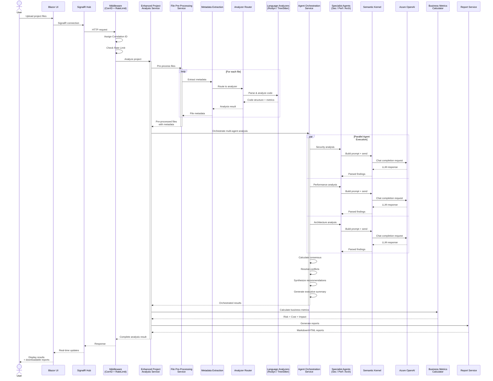
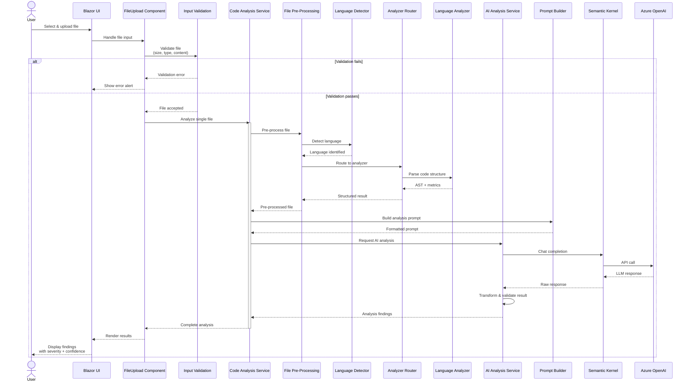
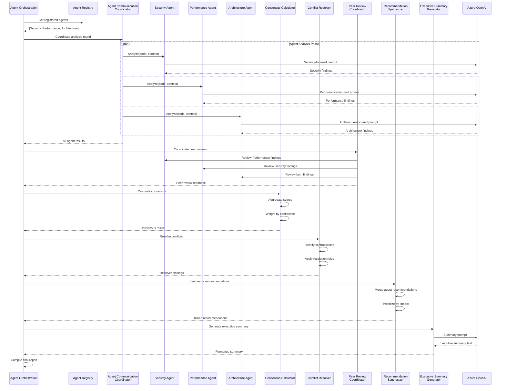
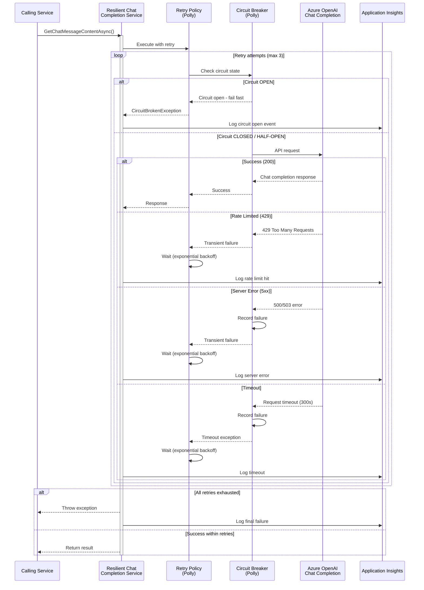
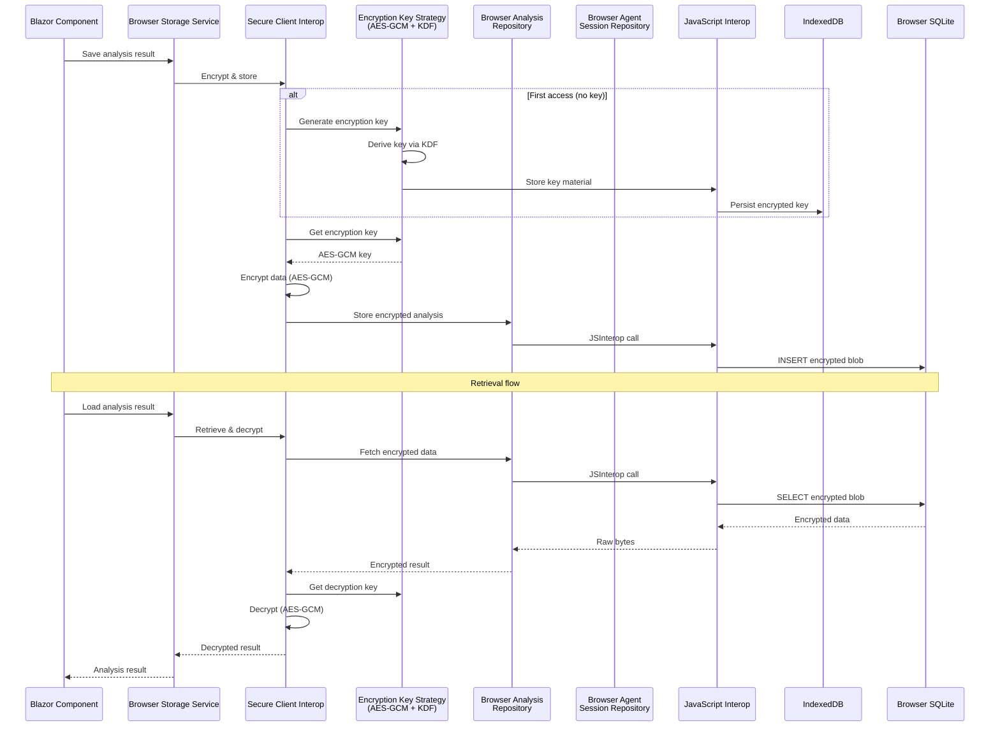
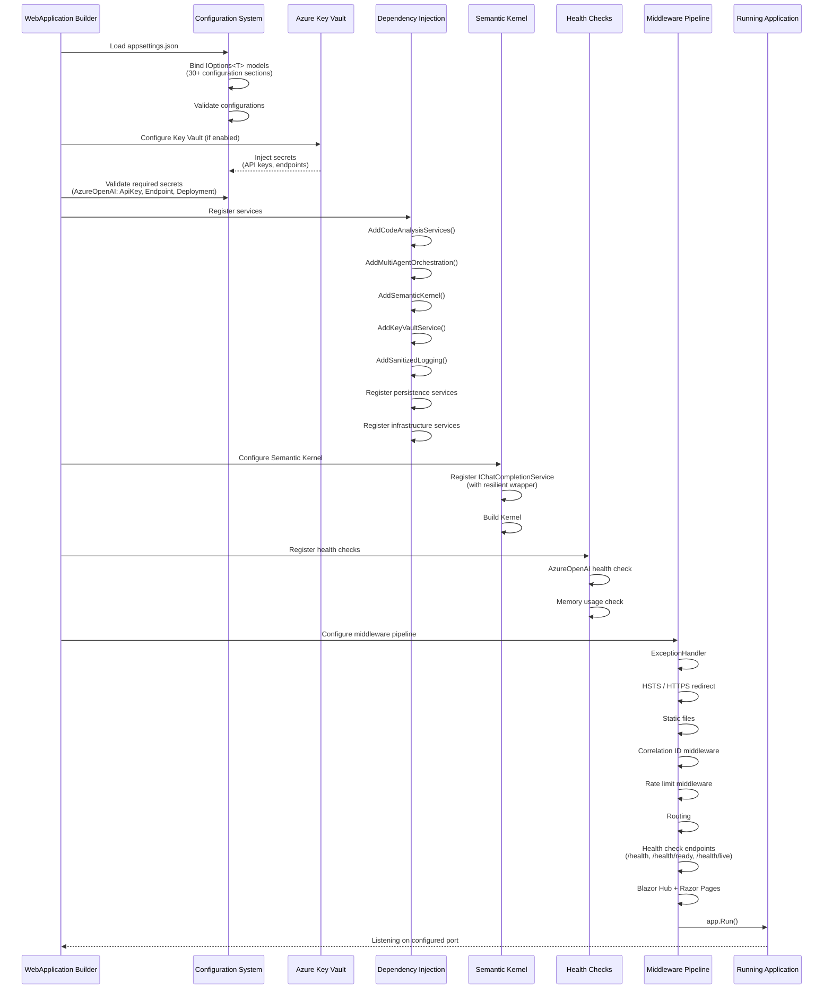

# System Interaction Diagrams - Legacy Code Analyzer

## 1. Multi-File Project Analysis - End-to-End Sequence

## 2. Single File Upload & Analysis Sequence

## 3. Multi-Agent Orchestration Interaction

## 4. Resilient Azure OpenAI Communication

## 5. Client-Side Persistence & Encryption Flow

## 6. Startup & Configuration Sequence

